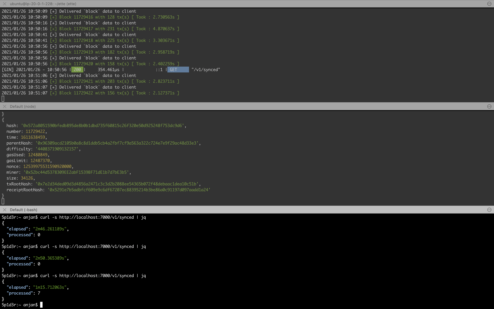
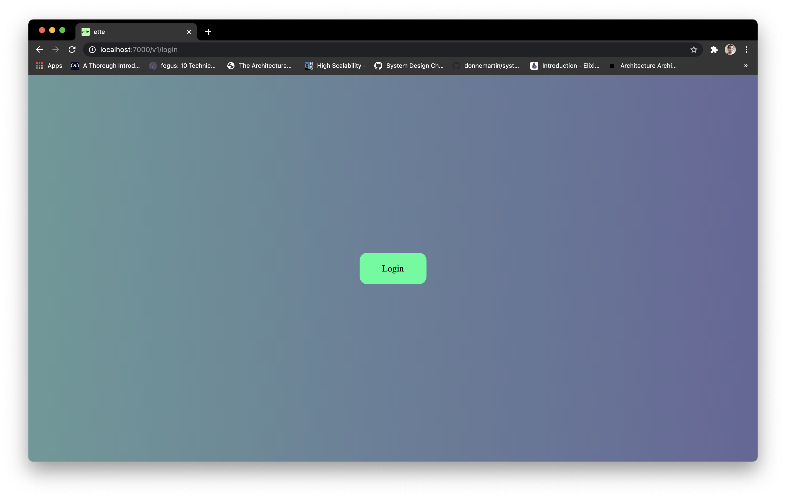
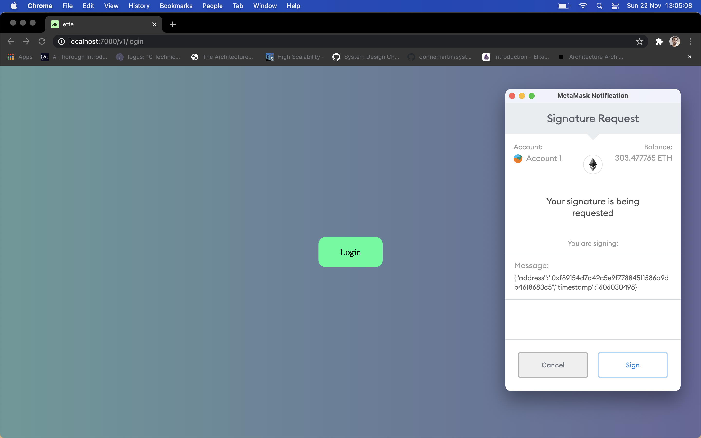
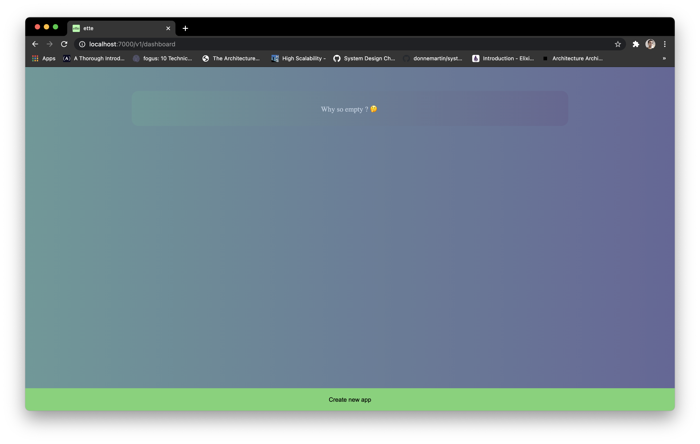
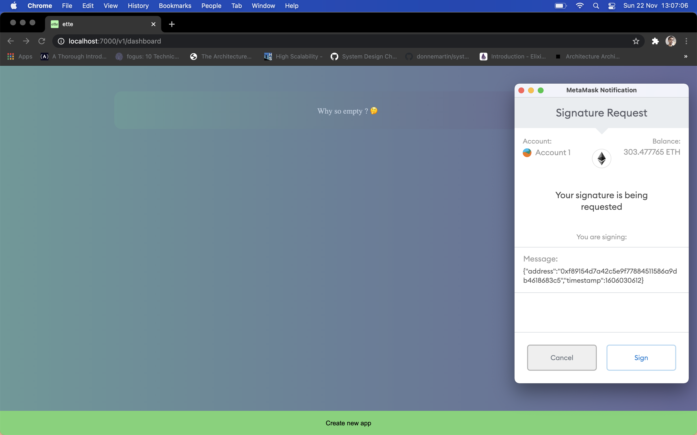
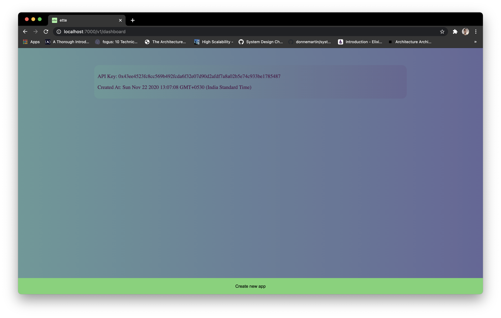
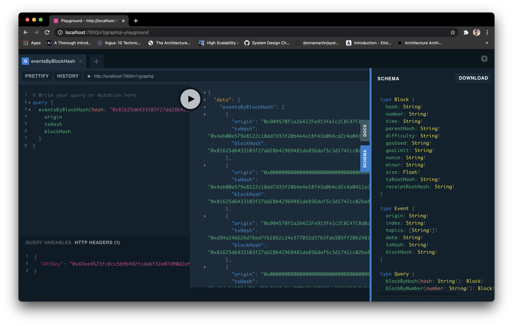
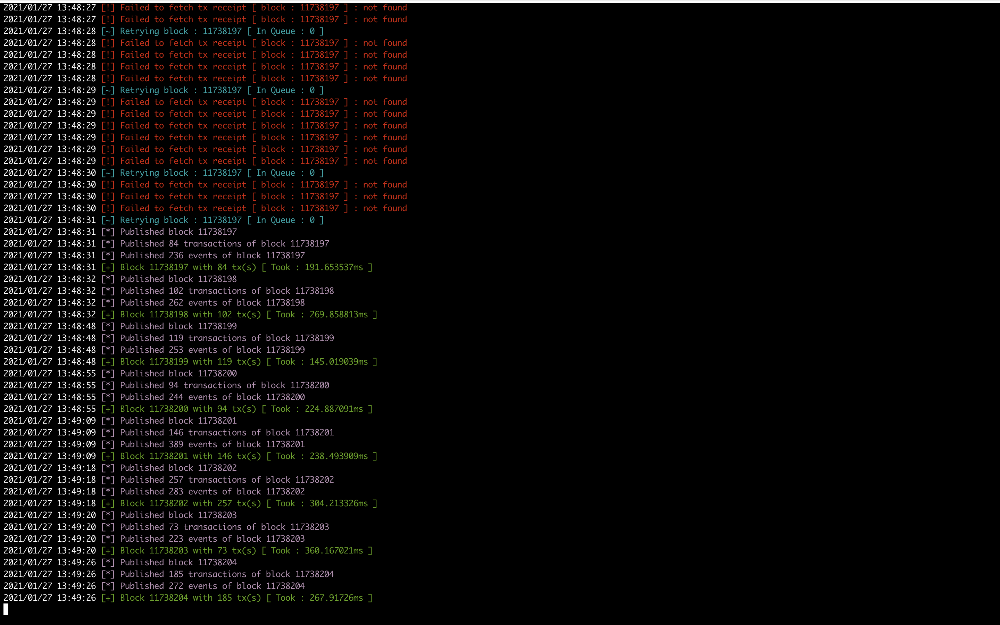
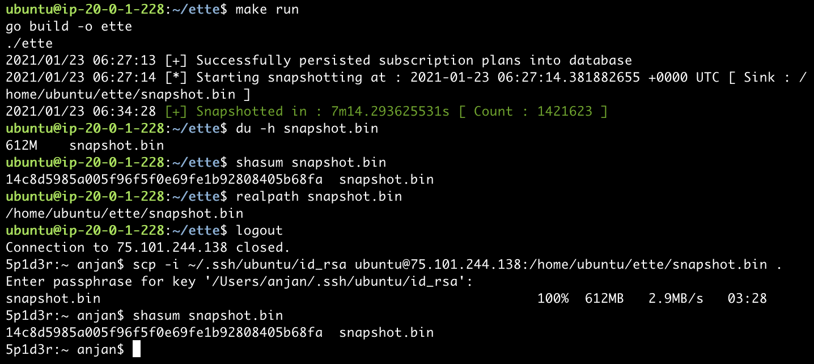
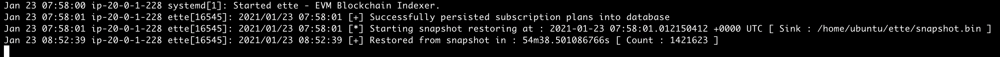

# ette

EVM-based Blockchain Indexer, with historical data query & real-time notification support 😎

**Deploy your `ette` instance today**


## Table of Contents

- [Why did you build `ette` ?](#inspiration-)
- [What do I need to have to use it ?](#prerequisite-)
- [How to install it ?](#installation-)
- [What are possible use cases of `ette` ?](#use-cases-)
- [How do I generate `APIKey`(s) ?](#management-using-webui-)
- [How to use it ?](#usage-)
    - Historical Data
        - Custom REST
            - [Query historical block data](#historical-block-data--rest-api--)
            - [Query historical transaction data](#historical-transaction-data--rest-api--)
            - [Query historical event data](#historical-event-data--rest-api--)
        - GraphQL ( **Recommended** )
            - [Query historical block data](#historical-block-data--graphql-api--)
            - [Query historical transaction data](#historical-transaction-data--graphql-api--)
            - [Query historical event data](#historical-event-data--graphql-api--)
    - Real-time Data
        - [Real-time block mining notification](#real-time-notification-for-mined-blocks-)
        - [Real-time transaction notification ( 🤩 Filters Added ) ](#real-time-notification-for-transactions-%EF%B8%8F)
        - [Real-time log event notification ( 🤩 Filters Added ) ](#real-time-notification-for-events-)
    - Snapshotting
        - [Take snapshot](#take-snapshot-of-existing-data-store-%EF%B8%8F)
        - [Restore from snapshot](#restore-data-from-snapshot-%EF%B8%8F)

## Inspiration 🤔

I was looking for one tool which will be able to keep itself in sync with latest happenings on EVM based blockchain i.e. index blockchain data, while exposing REST & GraphQL API for querying blockchain data with various filters. That tool will also expose real time notification functionalities over websocket, when subscribed to topics.

It's not that I was unable find any solution, but wasn't fully satisfied with those, so I decided to write `ette`, which will do following

- Sync upto latest state of blockchain
- Listen for all happenings on EVM based blockchain
- Persist all happenings in local database
- Expose REST & GraphQL API for querying 👇, while also setting block range/ time range for filtering results. Allow querying latest **X** entries for events emitted by contracts.
    - Block data
    - Transaction data
    - Event data

- Expose websocket based real time notification mechanism for 
    - Blocks being mined
    - Transactions being sent from address and/ or transactions being received at address
    - Events being emitted by contract, with indexed fields i.e. topics

- All historical data query requests must carry authentication header as `APIKey`, which can be generated by users, using webUI, packed with `ette`.
- All real-time event subscription & unsubscription requests must carry `apiKey` in their payload.
- It has very minimalistic webUI for creating & managing `APIKey`(s).
- It has capability to process blocks in delayed fashion, if asked to do so. **To address chain reorganization issue, this is very effective**. All you need to do, specify how many block confirmations you require before considering that block to be finalized in `.env` file. Now `ette` will do everything with block _( if real-time subscription mode is enabled, it'll publish data to clients who're interested i.e. subscribed )_ expect putting it in persistent data store. Rather block identifier to be put in waiting queue, from where it'll be eventually picked up by workers to finally persist it in DB. Only downside of using this feature is you might not get data back in response of query for certain block number, which just got mined but not finalized as per your set up i.e. `BlockConfirmations` environment variable's value. You can always skip it, default value will be **0**.

- `ette` can help you in taking snapshot of whole database, it's relying on, into a single binary file, where block data is serialized into Protocol Buffer format, efficient for deserialization also i.e. while restoring back from snapshot.
    - `EtteMode` = 4, attempts to take a snapshot of whole database.

- Restoring from snapshoted data file, can be attempted by `ette` when `EtteMode` = 5. Make sure you've cleaned backing data store before so & recreated database. [ **Table migration to be automatically taken care of** ]

- For snapshotting purposes, you can always set sink/ source data file in `SnapshotFile` in `.env`.

- 👆 snapshotting feature is helpful, if you're willing migrate `ette` to different machine or setting up new instance of `ette`. If you want to avoid a lengthy whole chain data syncing, you must take snapshot from existing instance of `ette` & attempt to restore from binary snapshot file in new `ette` instance.

And that's `ette`

## Prerequisite 👍



- Make sure you've Go _( >= 1.15 )_ installed
- You need to also install & set up PostgreSQL. I found [this](https://www.digitalocean.com/community/tutorials/how-to-install-and-use-postgresql-on-ubuntu-20-04) guide helpful.

> Make sure you've `pgcrypto` extension enabled on PostgreSQL Database.

> Check existing extensions using : `\dx`

> Create extension using : `create extension pgcrypto;`

- Redis needs to be installed too. Consider following [this](https://www.digitalocean.com/community/tutorials/how-to-install-and-secure-redis-on-ubuntu-20-04) guide.

> Note : Redis **v6.0.6** is required

> Note : Setting password in Redis instance has been made optional from now on, though it's recommended.

- Blockchain Node's both **HTTP & Websocket** connection URL required, because we'll be querying block, transaction, event log related data using HTTP interface & listening for block mining events in real time over Websocket.

## Installation 🛠

- First fork this repository & clone it, some where out side of **GOPATH**.

```bash
git clone git@github.com:username/ette.git
```

- Now get inside `ette`

```bash
cd ette
```

- Create a `.env` file in this directory. 

    - Make sure PostgreSQL has md5 authentication mechanism enabled.
    - Please enable password based authentication in Redis Server
    - Skipping `RedisPassword` is absolutely fine, if you don't want to use any password in Redis instance. [ **Not recommended** ]
    - Replace `Domain` with your domain name i.e. `ette.company.com`
    - Set `Production` to `yes` before running it in production; otherwise you can simply skip it
    - `ette` can be run in any of 👇 5 possible modes, which can be set by `EtteMode`

    ---

    EtteMode                | Interpretation
    ---                     | ---
    HISTORICAL              | Only Historical Data Query Allowed
    REALTIME                | Only Real-time Subscription Allowed
    HISTORICAL_AND_REALTIME | Both Historical Data Query & Real-time Subscription Allowed
    WRITE_SNAPSHOT          | Attempt to take snapshot from data in backing DB
    READ_SNAPSHOT           | Attempt to restore data from snapshot file

    ---

    - For testing historical data query using browser based GraphQL Playground in `ette`, you can set `EtteGraphQLPlayGround` to `yes` in config file
    - For processing block(s)/ tx(s) concurrently, it'll create `ConcurrencyFactor * #-of CPUs on machine` workers, who will pick up jobs submitted to them.
    - If nothing is specified, it defaults to 1 & assuming you're running `ette` on machine with 4 CPUs, it'll spawn worker pool of size 4. But more number of jobs can be submitted, only 4 can be running at max.
    - 👆 being done for controlling concurrency level, by putting more control on user's hand.
    - If you want to persist blocks in delayed fashion, you might consider setting `BlockConfirmations` to some _number > 0_.
    - That will make `ette` think you're asking it 80 is latest block, which can be persisted in final data store, when latest mined block number is 100 & `BlockConfirmations` is set to 20.
    - This option is **recommended** to be used, at least in production, to address _chain reorganization issue_.
    - For range based queries `BlockRange` can be set to limit how many blocks can be queried by client in a single go. Default value 100.
    - For time span based queries `TimeRange` can be set to put limit on max time span _( in terms of second )_, can be used by clients. Default value 3600 i.e. 1 hour.
    - If you're attempting to take snapshot/ restore from binary snapshot file, you can set `SnapshotFile` in `.env` file, to set sink/ source file name, respectively. Default file name `echo $(echo $(pwd)/snapshot.bin)` in i.e. from where `ette` gets invoked. Consider setting `EtteMode` correctly, depending upon what you want to attain.

```
RPCUrl=https://<domain-name>
WebsocketUrl=wss://<domain-name>
PORT=7000
DB_USER=user
DB_PASSWORD=password
DB_HOST=x.x.x.x
DB_PORT=5432
DB_NAME=ette
RedisConnection=tcp
RedisAddress=x.x.x.x:6379
RedisPassword=password
Domain=localhost
Production=yes
EtteMode=3
EtteGraphQLPlayGround=yes
ConcurrencyFactor=5
BlockConfirmations=200
BlockRange=1000
TimeRange=21600
SnapshotFile=snapshot.bin
```

- Create another file in same directory, named `.plans.json`, whose content will look like 👇.

    - This file holds subscription plans for clients, allowed by this `ette` instance.
    - Each plan is denoted by one unique `name` & `deliveryCount`, where _`deliveryCount` denotes number of times data to be delivered to client application in 24 hours of time span._
    - Because each request must be accompanied with `APIKey`, `ette` knows which user is requesting for resources & how many were delivered successfully in last 24 hours of time span.
    - If one user crosses allowed request limit in 24 hours, no new request will be taken under consideration & any existing connection will stop delivering data to client.

> **Quick Tip :** Setting `deliveryCount` is fully upto you. Please consider VM specifications before doing so.

```json
{
    "plans": [
        {
            "name": "TIER 1",
            "deliveryCount": 50000
        },
        {
            "name": "TIER 2",
            "deliveryCount": 100000
        },
        {
            "name": "TIER 3",
            "deliveryCount": 500000
        },
        {
            "name": "TIER 4",
            "deliveryCount": 750000
        },
        {
            "name": "TIER 5",
            "deliveryCount": 1000000
        }
    ]
}
```

- Now build `ette`

```bash
make build
```

- If everything goes as expected, you'll find one binary named, **ette** in this directory. Run it. 

```bash
./ette

# or directly run `ette` using 👇, which will first build, then run
make run
```

- Database migration to be taken care of during application start up.
- Syncing `ette` with latest state of blockchain takes time. Current sync state can be queried

```bash
curl -s localhost:7000/v1/synced | jq
```

- You'll receive response of form 👇

```json
{
  "elapsed": "3m2.487237s",
  "eta": "87h51m38s",
  "processed": 4242,
  "synced": "0.35 %"
}
```

- You can check how many active websocket sessions being managed by your `ette` deployment by


```bash
curl -s localhost:7000/v1/stat | jq
```

---

### Production deployment of `ette` using **systemd**

Here's a systemd unit file which you can create in `/etc/systemd/system`.

```bash
sudo touch /etc/systemd/system/ette.service # first do it
```

Now you can paste 👇 content in unit file, given that you've cloned `ette` in **$HOME**.

```bash
[Unit]
Description=ette - EVM Blockchain Indexer

[Service]
User=ubuntu
WorkingDirectory=/home/ubuntu/ette
ExecStart=/home/ubuntu/ette/ette
Restart=on-failure
RestartSec=10s

[Install]
WantedBy=multi-user.target
```

Time to load systemd.

```bash
sudo systemctl daemon-reload
```

Now you can enable `ette`, so that it can be automatically started after system boot up.

```bash
sudo systemctl enable ette.service
```

Finally you can start `ette`.

```bash
sudo systemctl start ette.service
```

You can also stop, running `ette` instance.

```bash
sudo systemctl stop ette.service
```

Restart an instance.

```bash
sudo systemctl restart ette.service
```

All logs `ette` produces can be inspected using 👇

```bash
sudo journalctl -u ette.service # oldest to newest
sudo journalctl -u ette.service --reverse # opposite of 👆
```

Latest log can be followed

```bash
sudo journalctl -u ette.service -f
```

---

## Use Cases 🤯

`ette` is supposed to be deployed by anyone, interested in running a historical data query & real-time notification service for EVM-based blockchain(s).

All client requests are by default rate limited _( 50k requests/ day )_. This rate limit is enforced on all `APIKey`(s) created by any single Ethereum Address. You can create multiple `APIKey`(s) from your account & accumulated requests made from those keys to be considered before dropping your requests.

If you need more requests per day, you can always asked your `ette` administrator to manually increase that from database table. _[ **Risky operation, needs to be done carefully. This is not recommended.** ]_

**More features coming here, soon**

## Management using webUI 🖥

`ette` has one minimalistic webUI for generating & managing `APIKey`(s). It doesn't have any password based login mechanism. You need to have [Metamask](https://metamask.io/download.html) browser plugin installed for logging into `ette` management webUI.

Once you've started `ette` on your machine, open browser & head to [http://localhost:7000/v1/login](http://localhost:7000/v1/login).

You'll be greeted with 👇



Assuming you've Metamask browser plugin installed, you can click `Login` & you'll be asked to sign a message of specific format, which will be validated by `ette`.



Once logged in, you can find out all `APIKey`(s) created by you.



If you've not any `APIKey`(s) created yet, go ahead & click `Create new app`. Again you'll be asked to sign a message of specific format.



And you'll see new `APIKey` on your screen.



You can create any number of `APIKey`(s), but rate limiting to be applied on aggregated requests from all those `APIKey`(s).

> Now go ahead & use `APIKey` in header of historical data query requests/ payload of real-time notification subscription/ unsubscription request.

**Double clicking on created `APIKey` toggles its enabled state, which is represented visually.** 👇


Enabled | Text Color
--- | ---
Yes | Green
No | Red

> **Quick Tip:** As you can create any number of `APIKey`(s) from one Ethereum address, if you feel any of those has been exposed, disabling those ensures all requests accompanied with those `APIKey`(s) to be dropped, by `ette`

Read further for usage examples.

## Usage 🦾

`ette` exposes REST & GraphQL API for querying historical block, transaction & event related data. It can also play role of real time notification engine, when subscribed to supported topics.

> **_All historical data query requests need to be strictly accompanied with valid `APIKey` as request header param_** 🤖

### Historical Block Data ( REST API ) 🤩

You can query historical block data with various combination of query string params. 👇 is a comprehensive guide for consuming block data.

**Path : `/v1/block`**

**Example code snippet can be found [here](example/block.sh)**

Query Params | Method | Description
--- | --- | ---
`hash=0x...&tx=yes` | GET | Fetch all transactions present in a block, when block hash is known
`number=1&tx=yes` | GET | Fetch all transactions present in a block, when block number is known
`hash=0x...` | GET | Fetch block by hash
`number=1` | GET | Fetch block by number
`fromBlock=1&toBlock=10` | GET | Fetch blocks by block number range _( max 10 at a time )_
`fromTime=1604975929&toTime=1604975988` | GET | Fetch blocks by unix timestamp range _( max 60 seconds timespan )_

### Historical Transaction Data ( REST API ) 😎

It's possible to query historical transactions data with various combination of query string params, where URL path is 👇

**Path : `/v1/transaction`**

**Example code snippet can be found [here](example/transaction.sh)**

Query Params | Method | Description
--- | --- | ---
`hash=0x...` | GET | Fetch transaction by txHash
`nonce=1&fromAccount=0x...` | GET | Fetch transaction, when tx sender's address & account nonce are known
`fromBlock=1&toBlock=10&deployer=0x...` | GET | Find out what contracts are created by certain account within given block number range _( max 100 blocks )_
`fromTime=1604975929&toTime=1604975988&deployer=0x...` | GET | Find out what contracts are created by certain account within given timestamp range _( max 600 seconds of timespan )_
`fromBlock=1&toBlock=100&fromAccount=0x...&toAccount=0x...` | GET | Given block number range _( max 100 at a time )_ & a pair of accounts, can find out all tx performed between that pair, where `from` & `to` fields are fixed
`fromTime=1604975929&toTime=1604975988&fromAccount=0x...&toAccount=0x...` | GET | Given time stamp range _( max 600 seconds of timespan )_ & a pair of accounts, can find out all tx performed between that pair, where `from` & `to` fields are fixed
`fromBlock=1&toBlock=100&fromAccount=0x...` | GET | Given block number range _( max 100 at a time )_ & an account, can find out all tx performed from that account
`fromTime=1604975929&toTime=1604975988&fromAccount=0x...` | GET | Given time stamp range _( max 600 seconds of span )_ & an account, can find out all tx performed from that account
`fromBlock=1&toBlock=100&toAccount=0x...` | GET | Given block number range _( max 100 at a time )_ & an account, can find out all tx where target was this address
`fromTime=1604975929&toTime=1604975988&toAccount=0x...` | GET | Given time stamp range _( max 600 seconds of span )_ & an account, can find out all tx where target was this address

### Historical Event Data ( REST API ) 🧐

`ette` lets you query historical event data, emitted by smart contracts, by combination of query string params.

**Path : `/v1/event`**

Query Params | Method | Description
--- | --- | ---
`blockHash=0x...` | GET | Given blockhash, retrieves all events emitted by tx(s) present in block
`blockHash=0x...&logIndex=1` | GET | Given blockhash and log index in block, attempts to retrieve associated event
`blockNumber=123456&logIndex=2` | GET | Given block number and log index in block, attempts to retrieve associated event
`txHash=0x...` | GET | Given txhash, retrieves all events emitted during execution of this transaction
`count=50&contract=0x...` | GET | Returns last **x** _( <=50 )_ events emitted by this contract
`fromBlock=1&toBlock=10&contract=0x...&topic0=0x...&topic1=0x...&topic2=0x...&topic3=0x...` | GET | Finding event(s) emitted from contract within given block range & also matching topic signatures _{0, 1, 2, 3}_
`fromBlock=1&toBlock=10&contract=0x...&topic0=0x...&topic1=0x...&topic2=0x...` | GET | Finding event(s) emitted from contract within given block range & also matching topic signatures _{0, 1, 2}_
`fromBlock=1&toBlock=10&contract=0x...&topic0=0x...&topic1=0x...` | GET | Finding event(s) emitted from contract within given block range & also matching topic signatures _{0, 1}_
`fromBlock=1&toBlock=10&contract=0x...&topic0=0x...` | GET | Finding event(s) emitted from contract within given block range & also matching topic signatures _{0}_
`fromBlock=1&toBlock=10&contract=0x...` | GET | Finding event(s) emitted from contract within given block range
`fromTime=1604975929&toTime=1604975988&contract=0x...&topic0=0x...&topic1=0x...&topic2=0x...&topic3=0x...` | GET | Finding event(s) emitted from contract within given time stamp range & also matching topic signatures _{0, 1, 2, 3}_
`fromTime=1604975929&toTime=1604975988&contract=0x...&topic0=0x...&topic1=0x...&topic2=0x...` | GET | Finding event(s) emitted from contract within given time stamp range & also matching topic signatures _{0, 1, 2}_
`fromTime=1604975929&toTime=1604975988&contract=0x...&topic0=0x...&topic1=0x...` | GET | Finding event(s) emitted from contract within given time stamp range & also matching topic signatures _{0, 1}_
`fromTime=1604975929&toTime=1604975988&contract=0x...&topic0=0x...` | GET | Finding event(s) emitted from contract within given time stamp range & also matching topic signatures _{0}_
`fromTime=1604975929&toTime=1604975988&contract=0x...` | GET | Finding event(s) emitted from contract within given time stamp range

### Historical Block Data ( GraphQL API ) 🤩

You can query block data using GraphQL API.

**Path: `/v1/graphql`**

**Method: `POST`**

```graphql
type Query {
    blockByHash(hash: String!): Block!
    blockByNumber(number: String!): Block!
    blocksByNumberRange(from: String!, to: String!): [Block!]!
    blocksByTimeRange(from: String!, to: String!): [Block!]!
}
```

Response will be of type 👇

```graphql
type Block {
  hash: String!
  number: String!
  time: String!
  parentHash: String!
  difficulty: String!
  gasUsed: String!
  gasLimit: String!
  nonce: String!
  miner: String!
  size: Float!
  txRootHash: String!
  receiptRootHash: String!
}
```

Method | Parameters | Possible use case
--- | --- | ---
`blockByHash` | hash: String! | When you know block hash & want to get whole block data back
`blockByNumber` | number: String! | When you know block number & want to get whole block data back
`blocksByNumberRange` | from: String!, to: String! | When you've a block number range & want to get all blocks in that range, in a single call
`blocksByTimeRange` | from: String!, to: String! | When you've unix timestamp range & want to get all blocks in that range, in a single call

---

### Historical Transaction Data ( GraphQL API ) 🤩

You can query transaction data from `ette`, using following GraphQL methods.

**Path: `/v1/graphql`**

**Method: `POST`**

```graphql
type Query {
    transaction(hash: String!): Transaction!
  
    transactionCountByBlockHash(hash: String!): Int!
    transactionsByBlockHash(hash: String!): [Transaction!]!
  
    transactionCountByBlockNumber(number: String!): Int!
    transactionsByBlockNumber(number: String!): [Transaction!]!
  
    transactionCountFromAccountByNumberRange(account: String!, from: String!, to: String!): Int!
    transactionsFromAccountByNumberRange(account: String!, from: String!, to: String!): [Transaction!]!
  
    transactionCountFromAccountByTimeRange(account: String!, from: String!, to: String!): Int!
    transactionsFromAccountByTimeRange(account: String!, from: String!, to: String!): [Transaction!]!
  
    transactionCountToAccountByNumberRange(account: String!, from: String!, to: String!): Int!
    transactionsToAccountByNumberRange(account: String!, from: String!, to: String!): [Transaction!]!

    transactionCountToAccountByTimeRange(account: String!, from: String!, to: String!): Int!
    transactionsToAccountByTimeRange(account: String!, from: String!, to: String!): [Transaction!]!

    transactionCountBetweenAccountsByNumberRange(fromAccount: String!, toAccount: String!, from: String!, to: String!): Int!
    transactionsBetweenAccountsByNumberRange(fromAccount: String!, toAccount: String!, from: String!, to: String!): [Transaction!]!

    transactionCountBetweenAccountsByTimeRange(fromAccount: String!, toAccount: String!, from: String!, to: String!): Int!
    transactionsBetweenAccountsByTimeRange(fromAccount: String!, toAccount: String!, from: String!, to: String!): [Transaction!]!

    contractsCreatedFromAccountByNumberRange(account: String!, from: String!, to: String!): [Transaction!]!
    contractsCreatedFromAccountByTimeRange(account: String!, from: String!, to: String!): [Transaction!]!
    transactionFromAccountWithNonce(account: String!, nonce: String!): Transaction!
}
```

Response will be of type 👇

```graphql
type Transaction {
  hash: String!
  from: String!
  to: String!
  contract: String!
  value: String!
  data: String!
  gas: String!
  gasPrice: String!
  cost: String!
  nonce: String!
  state: String!
  blockHash: String!
}
```

Method | Parameters | Possible use case
--- | --- | ---
`transaction` | hash: String! | When you know txHash & want to get that tx data
`transactionCountByBlockHash` | hash: String! | When you know block hash & want to get count of tx(s) packed in that block
`transactionsByBlockHash` | hash: String! | When you know block hash & want to get all tx(s) packed in that block
`transactionCountByBlockNumber` | number: String! | When you know block number & want to get count of tx(s) packed in that block
`transactionsByBlockNumber` | number: String! | When you know block number & want to get all tx(s) packed in that block
`transactionCountFromAccountByNumberRange` | account: String!, from: String!, to: String! | When you know tx sender address, block number range & want to find out how many tx(s) were sent by this address in that certain block number range
`transactionsFromAccountByNumberRange` | account: String!, from: String!, to: String! | When you know tx sender address, block number range & want to find out all tx(s) that were sent by this address in that certain block number range
`transactionCountFromAccountByTimeRange` | account: String!, from: String!, to: String! | When you know tx sender address, unix time stamp range & want to find out how many tx(s) were sent by this address in that certain timespan
`transactionsFromAccountByTimeRange` | account: String!, from: String!, to: String! | When you know tx sender address, unix time stamp range & want to find out all tx(s) that were sent by this address in that certain timespan
`transactionCountToAccountByNumberRange` | account: String!, from: String!, to: String! | When you know tx receiver address, block number range & want to find out how many tx(s) were sent to this address in that certain block number range
`transactionsToAccountByNumberRange` | account: String!, from: String!, to: String! | When you know tx receiver address, block number range & want to find out all tx(s) that were sent to this address in that certain block number range
`transactionCountToAccountByTimeRange` | account: String!, from: String!, to: String! | When you know tx receiver address, unix time stamp range & want to find out how many tx(s) were sent to this address in that certain timespan
`transactionsToAccountByTimeRange` | account: String!, from: String!, to: String! | When you know tx receiver address, unix time stamp range & want to find out all tx(s) that were sent to this address in that certain timespan
`transactionCountBetweenAccountsByNumberRange` | fromAccount: String!, toAccount: String!, from: String!, to: String! | When you know tx sender & receiver addresses, block number range & want to find out how many tx(s) were sent from sender to receiver in that certain block number range
`transactionsBetweenAccountsByNumberRange` | fromAccount: String!, toAccount: String!, from: String!, to: String! | When you know tx sender & receiver addresses, block number range & want to find out all tx(s) that were sent from sender to receiver in that certain block number range
`transactionCountBetweenAccountsByTimeRange` | fromAccount: String!, toAccount: String!, from: String!, to: String! | When you know tx sender & receiver addresses, unix timestamp range & want to find out how many tx(s) were sent from sender to receiver in that certain timespan
`transactionsBetweenAccountsByTimeRange` | fromAccount: String!, toAccount: String!, from: String!, to: String! | When you know tx sender & receiver addresses, unix timestamp range & want to find out all tx(s) that were sent from sender to receiver in that certain timespan
`contractsCreatedFromAccountByNumberRange` | account: String!, from: String!, to: String! | When you know EOA's _( externally owned account )_ address & want to find out all contracts created by that account in block number range
`contractsCreatedFromAccountByTimeRange` | account: String!, from: String!, to: String! | When you know EOA's _( externally owned account )_ address & want to find out all contracts created by that account in certain time span
`transactionFromAccountWithNonce` | account: String!, nonce: String! | When you have EOA's address & nonce value of it, you can pin point to that tx. This can be used to iterate through all tx(s) from this account, by updating nonce.

---

### Historical Event Data ( GraphQL API ) 🤩

You can ask `ette` for event data using GraphQL API.

**Path: `/v1/graphql`**

**Method: `POST`**

```graphql
type Query {
    eventsFromContractByNumberRange(contract: String!, from: String!, to: String!): [Event!]!
    eventsFromContractByTimeRange(contract: String!, from: String!, to: String!): [Event!]!
    eventsByBlockHash(hash: String!): [Event!]!
    eventsByTxHash(hash: String!): [Event!]!
    eventsFromContractWithTopicsByNumberRange(contract: String!, from: String!, to: String!, topics: [String!]!): [Event!]!
    eventsFromContractWithTopicsByTimeRange(contract: String!, from: String!, to: String!, topics: [String!]!): [Event!]!
    lastXEventsFromContract(contract: String!, x: Int!): [Event!]!
    eventByBlockHashAndLogIndex(hash: String!, index: String!): Event!
    eventByBlockNumberAndLogIndex(number: String!, index: String!): Event!
}
```

Response will be of type 👇

```graphql
type Event {
  origin: String!
  index: String!
  topics: [String!]!
  data: String!
  txHash: String!
  blockHash: String!
}
```

Method | Parameters | Possible use case
--- | --- | ---
`eventsFromContractByNumberRange` | contract: String!, from: String!, to: String! | When you've one contract address, block number range & you want to find out all events emitted by that contract in given block range
`eventsFromContractByTimeRange` | contract: String!, from: String!, to: String! | When you know contract address, unix time stamp range & you want to find out all events emitted by that contract in given timespan
`eventsByBlockHash` | hash: String! | When you've block hash & want to find out all events emitted in tx(s) packed in that block
`eventsByTxHash` | hash: String! | When you've txHash & want to find out all events emitted during execution of that tx
`eventsFromContractWithTopicsByNumberRange` | contract: String!, from: String!, to: String!, topics: [String!]! | When you've smart contract address, block number range & an ordered list of event log's topic signature(s), you can find out all events emitted by that contract with specific signature(s) in block range
`eventsFromContractWithTopicsByTimeRange` | contract: String!, from: String!, to: String!, topics: [String!]! | When you've smart contract address, unix time stamp range & an ordered list of event log's topic signature(s), you can find out all events emitted by that contract with specific signature(s) in given timespan
`lastXEventsFromContract` | contract: String!, x: Int! | When you know just contract address & want to find out last **X** events emitted by that contract **[ Very useful sometimes 😅 ]**
`eventByBlockHashAndLogIndex` | hash: String!, index: String! | When you know block hash, index of event log in block & want to get back specific event in that position
`eventByBlockHashAndLogIndex` | number: String!, index: String! | When you know block number, index of event log in block & want to get back specific event in that position

---

> Browser based GraphQL Playground : **/v1/graphql-playground** 👇🤩



---

### Real time notification for mined blocks ⛏



For listening to blocks getting mined, connect to `/v1/ws` endpoint using websocket client library & once connected, you need to send **subscription** request with 👇 payload _( JSON encoded )_

```json
{
    "name": "block",
    "type": "subscribe",
    "apiKey": "0x..."
}
```

If everything goes fine, your subscription will be confirmed with 👇 response _( JSON encoded )_

```json
{
    "code": 1,
    "message": "Subscribed to `block`"
}
```

After that as long as your machine is reachable, `ette` will keep notifying you about new blocks getting mined in 👇 form

```json
{
  "hash": "0x08f50b4795667528f6c0fdda31a0d270aae60dbe7bc4ea950ae1f71aaa01eabc",
  "number": 7015086,
  "time": 1605328635,
  "parentHash": "0x5ec0faff8b48e201e366a3f6c505eb274904e034c1565da2241f1327e9bad459",
  "difficulty": "6",
  "gasUsed": 78746,
  "gasLimit": 20000000,
  "nonce": 0,
  "miner": "0x0000000000000000000000000000000000000000",
  "size": 1044,
  "txRootHash": "0x088d6142b1d79803c851b1d839888b1e9f26c31e1266b4e221121f2cd8e85f86",
  "receiptRootHash": "0xca3949d52f113935ac08bae15e0816cd0472f01590f0fe0b65584bfb3aa324a6"
}
```

If you want to cancel subscription, consider sending 👇

```json
{
    "name": "block",
    "type": "unsubscribe",
    "apiKey": "0x..."
}
```

You'll receive 👇 response, confirming unsubscription

```json
{
    "code": 1,
    "message": "Unsubscribed from `block`"
}
```

> Sample code can be found [here](example/block.js)

### Real time notification for transactions ⚡️

For listening to any transaction happening in network in real-time, send 👇 JSON encoded payload to `/v1/ws`

```json
{
    "name": "transaction/<from-address>/<to-address>",
    "type": "subscribe",
    "apiKey": "0x..."
}
```

**Here we've some examples :**

- Any transaction

```json
{
    "name": "transaction/*/*",
    "type": "subscribe",
    "apiKey": "0x..."
}
```

> Sample Code can be found [here](example/transaction_1.js)

- Fixed `from` field **[ tx originated `from` account ]**

```json
{
    "name": "transaction/0x4774fEd3f2838f504006BE53155cA9cbDDEe9f0c/*",
    "type": "subscribe",
    "apiKey": "0x..."
}
```

> Sample Code can be found [here](example/transaction_2.js)

- Fixed `to` field **[ tx targeted `to` account ]**

```json
{
    "name": "transaction/*/0x4774fEd3f2838f504006BE53155cA9cbDDEe9f0c",
    "type": "subscribe",
    "apiKey": "0x..."
}
```

> Sample Code can be found [here](example/transaction_3.js)

- Fixed `from` & `to` field **[ tx `from` -> `to` account ]**

```json
{
    "name": "transaction/0xc9D50e0a571aDd06C7D5f1452DcE2F523FB711a1/0x4774fEd3f2838f504006BE53155cA9cbDDEe9f0c",
    "type": "subscribe",
    "apiKey": "0x..."
}
```

> Sample Code can be found [here](example/transaction_4.js)

If everything goes fine, your subscription will be confirmed with 👇 response _( JSON encoded )_

```json
{
    "code": 1,
    "message": "Subscribed to `transaction`",
    "apiKey": "0x..."
}
```

After that as long as your machine is reachable, `ette` will keep notifying you about every transaction happening in 👇 form, where criterias matching

```json
{
  "hash": "0x08cfda79bd68ad280c7786e5dd349ab81981c52ea5cdd8e31be0a4b54b976555",
  "from": "0xc9D50e0a571aDd06C7D5f1452DcE2F523FB711a1",
  "to": "0x4774fEd3f2838f504006BE53155cA9cbDDEe9f0c",
  "contract": "",
  "value": "",
  "data": "0x35086d290000000000000000000000000000000000000000000000000000000000000360",
  "gas": 200000,
  "gasPrice": "1000000000",
  "cost": "200000000000000",
  "nonce": 19899,
  "state": 1,
  "blockHash": "0xc29170d33141602a95b915c954c1068a380ef5169178eef2538beb6edb005810"
}
```

If you want to cancel subscription, consider sending 👇, while replacing `<from-address>` & `<to-address>` with specific addresses you used when subscribing.

```json
{
    "name": "transaction/<from-address>/<to-address>",
    "type": "unsubscribe",
    "apiKey": "0x..."
}
```

You'll receive 👇 response, confirming unsubscription

```json
{
    "code": 1,
    "message": "Unsubscribed from `transaction`"
}
```

### Real-time notification for events 📧

For listening to any events getting emitted by smart contracts deployed on network, you need to send 👇 JSON encoded payload to `/v1/ws` endpoint, after connecting over websocket

```json
{
    "name": "event/<contract-address>/<topic-0-signature>/<topic-1-signature>/<topic-2-signature>/<topic-3-signature>",
    "type": "subscribe",
    "apiKey": "0x..."
}
```

**Here we've some examples :**

- Any event emitted by any smart contract in network

```json
{
    "name": "event/*/*/*/*/*",
    "type": "subscribe",
    "apiKey": "0x..."
}
```

- Any event emitted by one specific smart contract

```json
{
    "name": "event/0xcb3fA413B23b12E402Cfcd8FA120f983FB70d8E8/*/*/*/*",
    "type": "subscribe",
    "apiKey": "0x..."
}
```

- Specific event emitted by one specific smart contract

```json
{
    "name": "event/0xcb3fA413B23b12E402Cfcd8FA120f983FB70d8E8/0x2ab93f65628379309f36cb125e90d7c902454a545c4f8b8cb0794af75c24b807/*/*/*",
    "type": "subscribe",
    "apiKey": "0x..."
}
```

- Specific event emitted by any smart contract in network

```json
{
    "name": "event/*/0xddf252ad1be2c89b69c2b068fc378daa952ba7f163c4a11628f55a4df523b3ef/*/*/*",
    "type": "subscribe",
    "apiKey": "0x..."
}
```

> Sample code can be found [here](example/event_1.js)

If everything goes fine, your subscription will be confirmed with 👇 JSON encoded response

```json
{
    "code": 1,
    "message": "Subscribed to `event`"
}
```

After that as long as your machine is reachable, `ette` will keep notifying you about every event emitted by smart contracts, to which you've subscribed to, in 👇 format

```json
{
  "origin": "0x0000000000000000000000000000000000001010",
  "index": 3,
  "topics": [
    "0x4dfe1bbbcf077ddc3e01291eea2d5c70c2b422b415d95645b9adcfd678cb1d63",
    "0x0000000000000000000000000000000000000000000000000000000000001010",
    "0x0000000000000000000000004d31abd8533c00436b2145795cc4cef207c3364f",
    "0x00000000000000000000000042eefcda06ead475cde3731b8eb138e88cd0bac3"
  ],
  "data": "0x0000000000000000000000000000000000000000000000000000454b2247e2000000000000000000000000000000000000000000000000001a96ae0b49dfc60000000000000000000000000000000000000000000000003a0df005a45c3dd5dd0000000000000000000000000000000000000000000000001a9668c02797e40000000000000000000000000000000000000000000000003a0df04aef7e85b7dd",
  "txHash": "0xfdc5a29fdd57a53953a542f4c46b0ece5423227f26b1191e58d32973b4d81dc9",
  "blockHash": "0x08e9ac45e4041a4309c6f5dd42b0fc78e00ca0cb8603965465206b22a63d07fb"
}
```

If you want to cancel subscription, consider sending 👇, while replacing `<contract-address>`, `<topic-{0,1,2,3}-signature>` with specific values you used when subscribing.

```json
{
    "name": "event/<contract-address>/<topic-0-signature>/<topic-1-signature>/<topic-2-signature>/<topic-3-signature>",
    "type": "unsubscribe",
    "apiKey": "0x..."
}
```

You'll receive 👇 response, confirming unsubscription

```json
{
    "code": 1,
    "message": "Unsubscribed from `event`"
}
```

> Note: If graceful unsubscription not done, when `ette` finds client unreachable, it'll remove client subscription

### Take snapshot of existing data store ➡️

Assuming you've already a running instance of `ette` for some EVM compatible chain, you can always attempt to take snapshot of whole backing data store, so that if you need to spin up another instance of `ette`, you won't require to sync whole chain data, rather you use this binary data file, which can be used by `ette` for restoring from snapshot data.

Setting `EtteMode` = 4, attempts to take snapshot of DB. 



### Restore data from snapshot ⬅️

Once you've snapshotted binary encoded data file, you can attempt to restore from this & rebuild whole data store, with out syncing whole chain data. `EtteMode` = 5, attempts to do 👇.



Once that's done, consider restarting `ette` in desired mode so that it can keep itself in sync with latest chain happenings.

**More coming soon**
